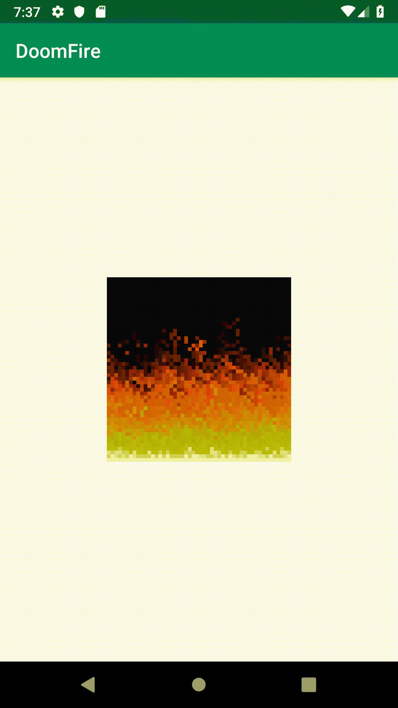

# Implementação do algotimo com Kotlin e Android

Esta é uma implementação do algotimo mostrado pelo Felipe Deschamps no vídeo: https://www.youtube.com/watch?v=fxm8cadCqbs.

O código foi todo implementado em Kotlin e também utilizei a lib Anko.

## Autor

Kassiano Resende

