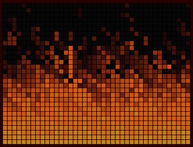

# Doom Fire

DOOM fire animated from server side.

[**Most interesting folder to see the algorithm**](./lib/live_doom_fire_web/live/)

Made with [Phoenix LiveView](https://github.com/phoenixframework/phoenix_live_view) 
Based on [Doom fire algorithm](https://github.com/filipedeschamps/doom-fire-algorithm)

To start your Phoenix server:

  * Install dependencies with `mix deps.get`
  * Create and migrate your database with `mix ecto.create && mix ecto.migrate`
  * Install Node.js dependencies with `cd assets && npm install`
  * Start Phoenix endpoint with `mix phx.server`

Now you can visit [`localhost:4000`](http://localhost:4000) from your browser.

## Learn more

  * Official website: http://www.phoenixframework.org/
  * Guides: http://phoenixframework.org/docs/overview
  * Docs: https://hexdocs.pm/phoenix
  * Mailing list: http://groups.google.com/group/phoenix-talk
  * Source: https://github.com/phoenixframework/phoenix
