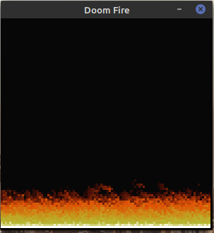

# Doom-fire
Repositório implementando o fogo do doom.
Baseado no [video](https://www.youtube.com/watch?v=fxm8cadCqbs) do Felipe Deschamps, porém usando pygame para renderização.

## 🚀 Inicio rápidos
1. Use o comando a seguir para isso
```shell
git clone https://github.com/jpalvesl/Doom-fire.git
```

3. **Instale a biblioteca com o seguinte comando**  
  ```shell
  pip3 install pip3 install pygame 
  ```

2. **Navegue até a pasta com os arquivos fonte**  

```shell
cd src
```

3. **Execute o comando** 
  ```shell
  python3 Doom_fire.py
  ```

## Código em execução
