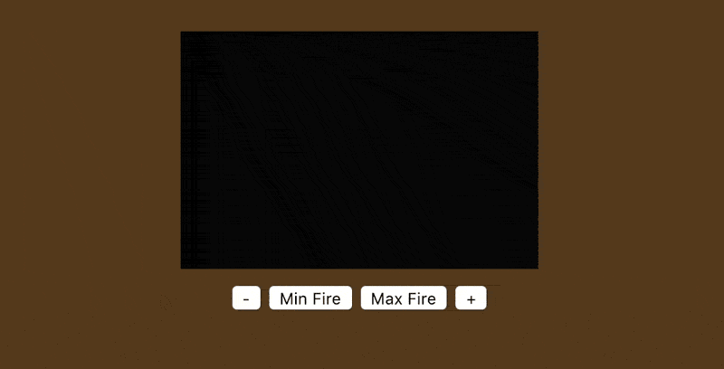

  

# Doom Fire Algorithm Rendered with GPU.js

A Doom Fire version able to render more than 10x the original amount of pixels without lag.

To reach this the code uses the the JS library [GPU.js](https://github.com/gpujs/gpu.js)

To improve the code speed even further, before the rendering process starts a large table with random values is created. Instead of requesting a `Math.random()` before each frame the code uses a value stored in the table, drastically reducing the processing power requirement to calculate the fire propagation. The result is indistinguishable from the "Really Random Generated Fire".

## This Version Author

| [ @thadeucity](https://github.com/thadeucity) |
| :---: |

## Original Doom Fire Author

| [ @filipedeschamps](https://github.com/filipedeschamps) |
| :---: |

